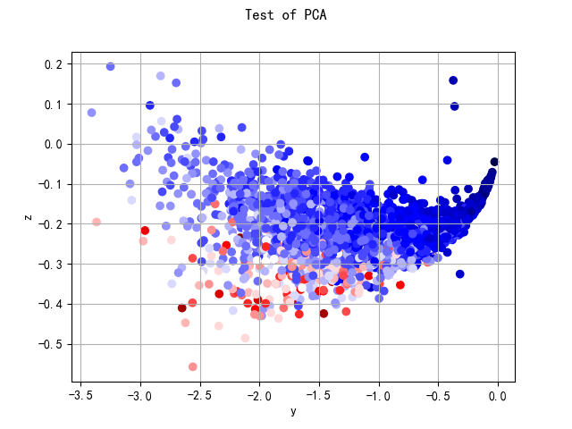
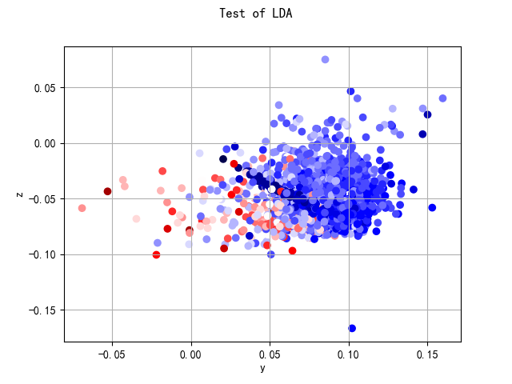
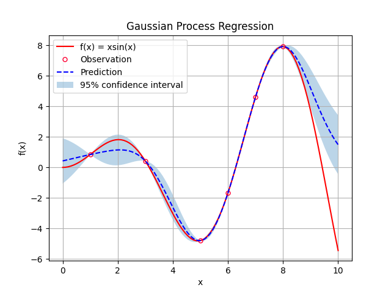
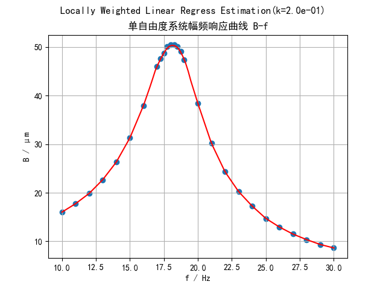
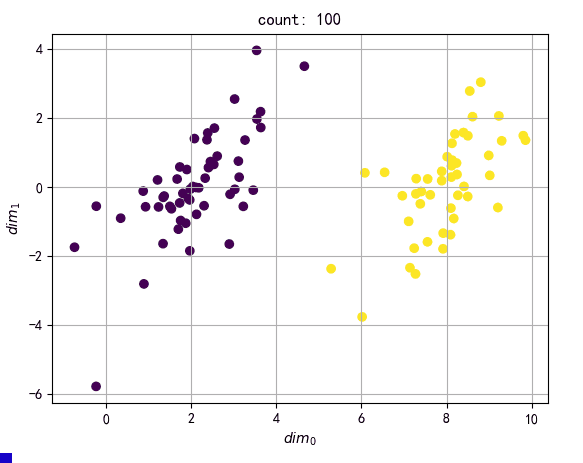
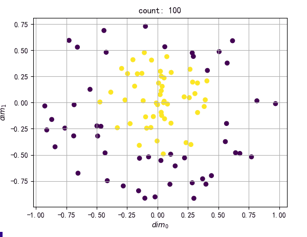
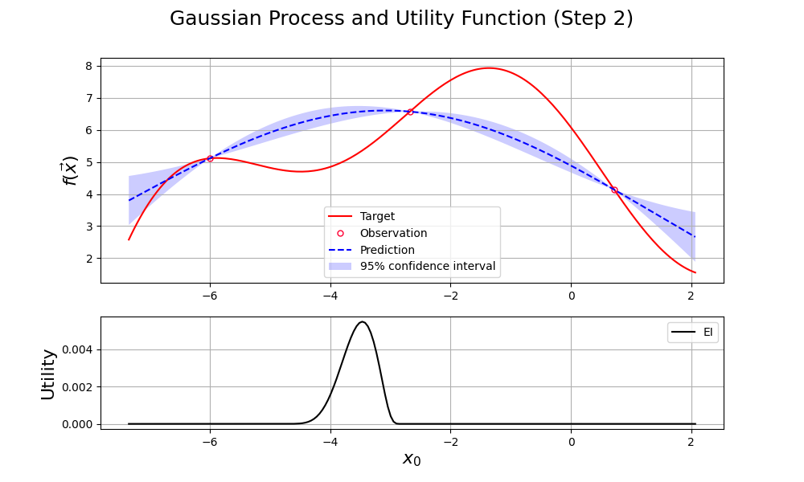
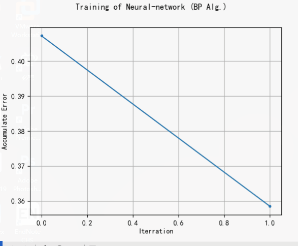
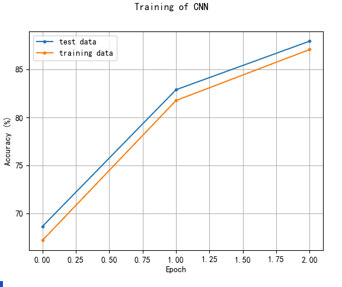

# 经典机器学习算法复现

 

****
* **PCA和LDA：**
****

## 

 

****
* **GPR和LWLR：**
****

##

 

****
* **SVM：**
****

##

 

****
* **梯度优化方法：**
****

 

****
* **贝叶斯优化：**
****

##

 

****
* **从零实现的神经网络（训练过程）：**
****

##

 

**等等...**

 

